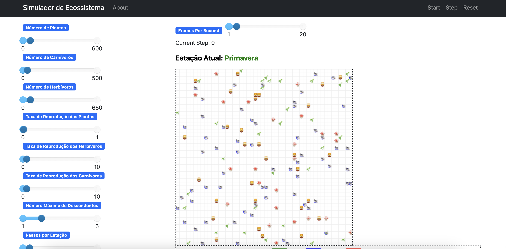
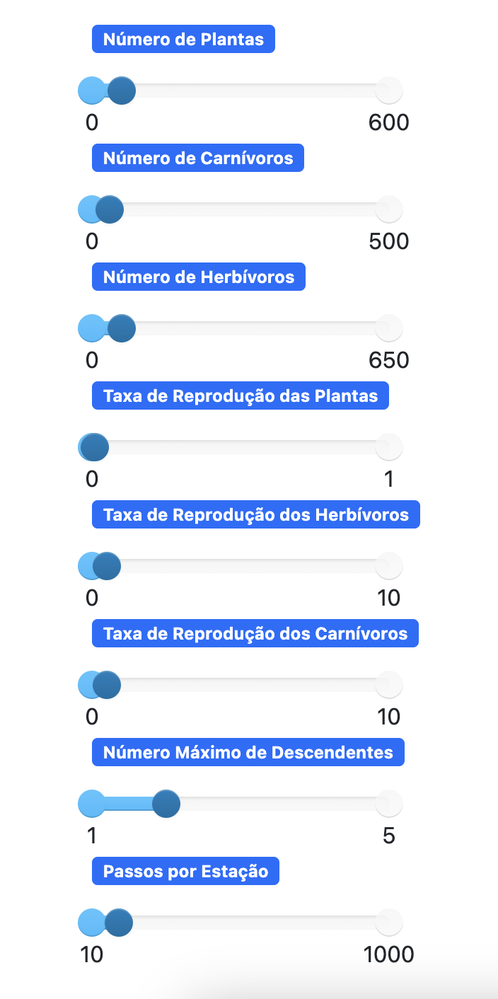
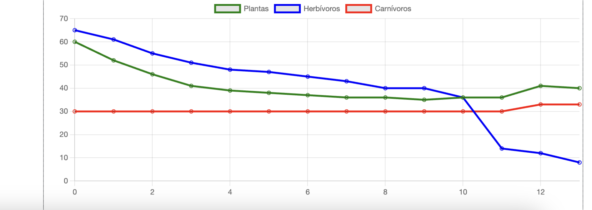

# Grupo 2 SMA

**Disciplina**: FGA0210 - PARADIGMAS DE PROGRAMAÇÃO - T01 <br>
**Nro do Grupo (de acordo com a Planilha de Divisão dos Grupos)**: 02<br>
**Paradigma**: SMA<br>

## Alunos
|Matrícula | Aluno |
| -- | -- |
|Ailton Aires|180011600|
|Arthur Sena|180030345|
|Eric Chagas de Oliveira|180119508|
|Fernando Vargas|180016491|
|Gabriel Luiz|190013354|
|Guilherme Daniel Fernandes da Silva|180018019|
|Kevin Luis|180042386|
|Thiago Vivan|190020407|
|Victor Buendia|190020601|

## Sobre

É uma aplicação baseada no paradigma de sistemas multiagentes, desenvolvida utilizando o framework Mesa em Python. Seu objetivo é simular a dinâmica de um ecossistema composto por três tipos de agentes: plantas, herbívoros e carnívoros. Cada agente possui comportamentos específicos, como reprodução, alimentação e movimentação, que interagem para modelar as relações ecológicas entre presas, predadores e recursos naturais. A simulação permite observar como essas interações afetam o equilíbrio populacional e a sustentabilidade do ecossistema ao longo do tempo. Na aplicação, é possível alterar as seguintes variáveis para simular o ecossistema ao longo do tempo:

- Alteração da quantidade inicial de Carnívoros;

- Alteração da quantidade inicial de Herbívoros;

- Alteração da quantidade inicial de Plantas;

- Alteração da quantidade inicial de Herbívoros;

- Alteração da Taxa de Reprodução das Plantas

- Alteração da Taxa de Reprodução dos Herbívoros

- Alteração do Número Máximo de Descendentes

- Alteração do Número de Passos para mudança de Estação

## Screenshots


<p><strong>Figura 1:</strong> Estado Inicial do Ecossistema - Representa a configuração inicial do ecossistema, mostrando a distribuição das plantas, herbívoros e carnívoros no ambiente.</p>


<p><strong>Figura 2:</strong> Variáveis do Modelo - Exibe as variáveis principais utilizadas na simulação, como taxas de reprodução, taxa de crescimento das plantas, e taxas de predação.</p>


<p><strong>Figura 3:</strong> Gráfico de Dinâmica Populacional - Apresenta um gráfico que ilustra a evolução das populações de plantas, herbívoros e carnívoros ao longo do tempo durante a simulação.</p>

## Instalação

**Linguagens**: Python

**Tecnologias**: Mesa

Para executar o projeto, é necessário uma instalação do Python 3 e a biblioteca venv.
No MacOS:
```
brew install python3 python3-venv
```

Em sistemas Debian (ou derivados):

```
sudo apt install python3 python3-venv
```

Para realizar o setup criando o ambiente virtual e instalando as dependências, rode o comando:

```
make install
```

Caso queira limpar o ambiente virtual:

```
make clean
```

## Uso 

Após a instalação, executar o seguinte comando:

```
make run
```
## Vídeo

|Vídeo|Link|
|-|-|
| Equilíbrio de ecossistemas: Apresentação do módulo SMA | [Apresentacao](https://youtu.be/i2COfWX2m9E) |

## Participações

Segue a tabela com as participações de cada membro do grupo no projeto.

|Nome do Membro | Contribuição | Significância da Contribuição para o Projeto (Excelente/Boa/Regular/Ruim/Nula) |
| -- | -- | -- |
|Ailton Aires| Morte randômica dos agentes <br/> Adiciona nutrientes ao solo <br/> Adiciona maior taxa de reprodução da planta quando o solo estiver fértil <br/>  | Boa |
|Arthur Sena| - Setup da aplicação com ambiente virtual e Makefile <br/> - Adição da consciência aos herbívoros, de forma que, aleatoriamente, alguns deles, tenham a capacidade de fugir de predadores <br/> - Adição de memória aos herbívoros, de forma que os mesmos priorizem locais onde já viram plantas anteriormente, ao invés de sempre se moverem aleatoriamente <br/> - Criação da lógica de plantas venenosas, que adoecem os herbívoros <br/> - Criação de lógica de animais doentes e idosos que serão mais afetados por fome ou envenenamento <br/> - Refatoração do pacote de agentes, modularizando o código e facilitando a manutenibilidade | Excelente |
|Fernando Vargas| - Modularização e refatoração do server e models <br/> - Customização da visualização dos agentes <br/> - Ajustes no slider dos herbivoros e na reprodução dos herbívoros | Boa |
|Eric Chagas| Implementação da classe de polinizadores (Pollinators) <br/> Lógica de "polinização", um polinizador adquire pólen de uma planta e poliniza outro ponto do grid, auxiliando na reprodução da classe de plantas <br/> Lógica de idade, reprodução e morte para os polinizadores <br/> Visualização dos polinizadores no gráfico da simulação | Boa |
|Gabriel Gomes|  - | - |
|Guilherme Daniel| - Implementação de gêneros nos agentes (Carnívoros e Herbívoros), de modo que só podem reproduzir com gênero oposto <br /> - Implementação de estações do ano, alterando o comportamento de crescimento de plantas baseado na estação atual <br /> - Implementação do algoritmo de movimentação baseado no Algoritmo de Busca A* <br /> - Implementação de condição de fome nos animais (Herbívoros e Carnívoros) <br /> - Implementação de funcionalidade de adaptação natural dos animais (herança genética) <br /> - Escrita do README <br /> | Excelente |
|Kevin Luis| - Reprodução dos carnívoros e uma função de reprodução genérica no agente base <br /> - Validações para reprodução dos carnívoros <br /> - Condições para morte de um carnívoro <br /> - Configurações de parametros dinâmicos (Taxa de reprodução e número máximo de descendentes) | Excelente |
|Victor Buendia| - Criação da estrutura do SMA usando o Mesa</br> - Criação do servidor</br> - Criação do modelo do ecossistema</br> - Criação do agente herbívoro, carnívoro e planta</br> - Criação do agente base para herança dos agentes específicos | Excelente |
|Thiago Vivan| Implementação da classe de polinizadores (Pollinators) <br/> Lógica de "polinização", um polinizador adquire pólen de uma planta e poliniza outro ponto do grid, auxiliando na reprodução da classe de plantas <br/> Lógica de idade, reprodução e morte para os polinizadores <br/> Visualização dos polinizadores no gráfico da simulação <br/> Ajustes na lógica de morte e reprodução de carnivoros e herbívoros | Boa |

## Outros 

### Lições Aprendidas

Durante a execução do trabalho, foram extraídas as seguintes lições aprendidas:

- Apesar da facilidade no uso do framework MESA, encontramos diversas dificuldades relacionadas à personalização das telas de simulação.

- O paradígma utiliza os mesmos conceitos utilizados em threads. Por isso, em alguns momentos ele utiliza muitos recursos de hardware, sendo difícil testá-lo. Além disso, diante dessa limitação, torna-se desafiador pensar em aplicações robustas e escaláveis.

- Durante a execução do trabalho, não encontramos uma maneira de alterar algumas configurações do servidor definidas na inicialização da aplicação usando o framework MESA.

### Percepções

- A curva de aprendizado do framework MESA é relativamente baixa para quem já tem familiaridade com Python, tornando o desenvolvimento mais fácil.

- A personalização das telas de simulação do MESA pode ser restrita, dificultando a criação de interfaces que atendam a requisitos específicos de visualização e controle.

- O framework permite uma alta modularidade no desenvolvimento de simulações, o que facilita a reutilização de código.

### Contribuições e Fragilidades

- Devido à complexidade de modelar uma aplicação que simule um ecossistema, por conta da dificuldade de entender o contexto e definir todas as variáveis que serão utilizadas no sistema, a simulação não apresenta o melhor resultado quanto ao contexto real.

- Apesar dos animais estarem divididos em Carnívoros e Herbívoros, há diversas especificidades dos tipos de animais que não foram abordadas e/ou tratadas nessa aplicação, como expectativa de vida, comportamento social, etc.

- As plantas podem estar modeladas de forma muito genérica, sem considerar a diversidade de espécies vegetais, suas diferentes taxas de crescimento, modos de reprodução e respostas a condições ambientais.

### Trabalhos Futuros

Para trabalhos futuros, alguns possíveis incrementos no projeto são:

- Implementar especificidades dos tipos de animais, como expectativa de vida e comportamento social, na simulação.

- Implementar plantas com características diversas.

- Implementar mutações aleatórias nos filhos.

- Implementar eventos ambientais, como incêndios e secas.

- Aumentar complexidade da simulação, adicionando características mais específicas ao animais.

- Implementar possibilidade de adicionar espécie invasora no ecossistema.

## Fontes

> Linguagem de programação: https://www.python.org/; <br />
> Interface gráfica (Mesa): https://mesa.readthedocs.io/en/stable/; <br />
> Inspiração: https://github.com/UnBParadigmas2023-2/2023.2_G6_SMA_PresaPredador/tree/main <br />
> Distribuição de Carnívoros e Herbívoros: https://www.nature.com/scitable/knowledge/library/dynamics-of-predation-13229468/ <br />
